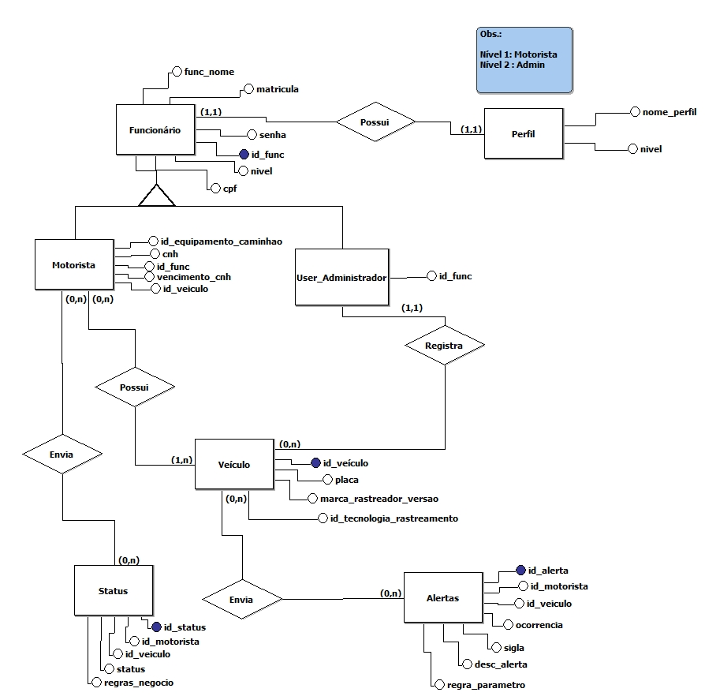
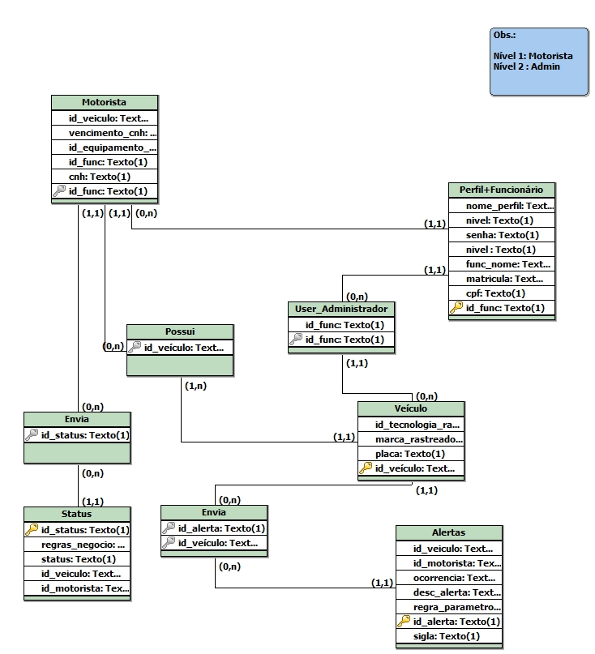

# Projeto Integrador FATECSJC 2020_2

# Objetivo
Para a entrega dessa Sprint, temos como objetivo realizar o login do usuário ao sistema e o cadastro dos dados dos funcionários, além disso, acertar algumas coisas da sprint anterior.

# Funcionalidades
As funcionalidades dessa Sprint consistem no login e cadastro do usuário, sendo o cadastro feito pelo administrador. Para os dois será utilizado um banco de dados PostgreSQL hospedado em um servidor remoto.

# Disciplinas Integradas
- Engenharia de Softaware ( Profª. Juliana Forin Pasquini Martiniz) 
- Sistemas de Informações (Profº. Cláudio Etelvino de Lima)

# Equipe (Grupo 4)
DevTeam:
- LUCAS VINICIUS DOS SANTOS ALMEIDA
- GABRIEL FERREIRA FABIAN
- JOAO VITOR DE PAULA RODRIGUES MACHADO

Scrum Master:
- NICOLAS SOARES TELLES

Product Owner: 

- MAYCON RAFAEL CRUZ SILVA

# Protótipo do App

Obs: Os protótipos foram feitos no SceneBuilder 8.5.0, um editor para desenvolver as telas do programa. Escolhemos fazer pelo SceneBuilder para evitar problemas com o desenvolvimento final das telas.

# Modelagem do BD
- Modelo conceitual

- Modelo lógico

# Acesse o Product Backlog
https://github.com/nicolastelles/PI-IACIT/projects/2
