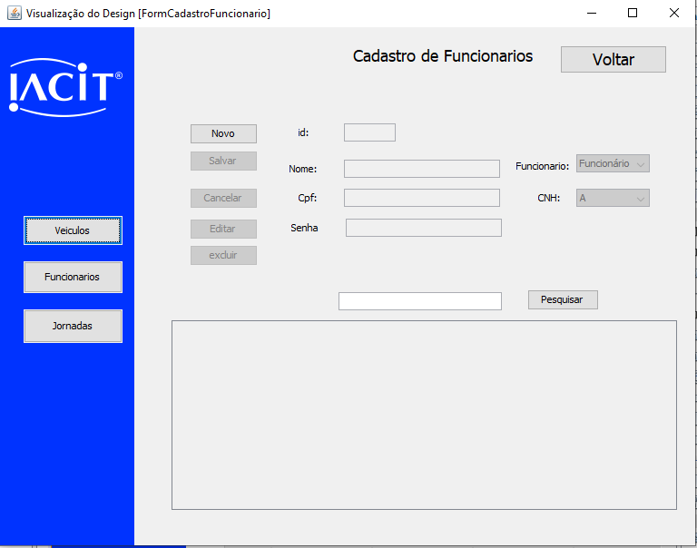
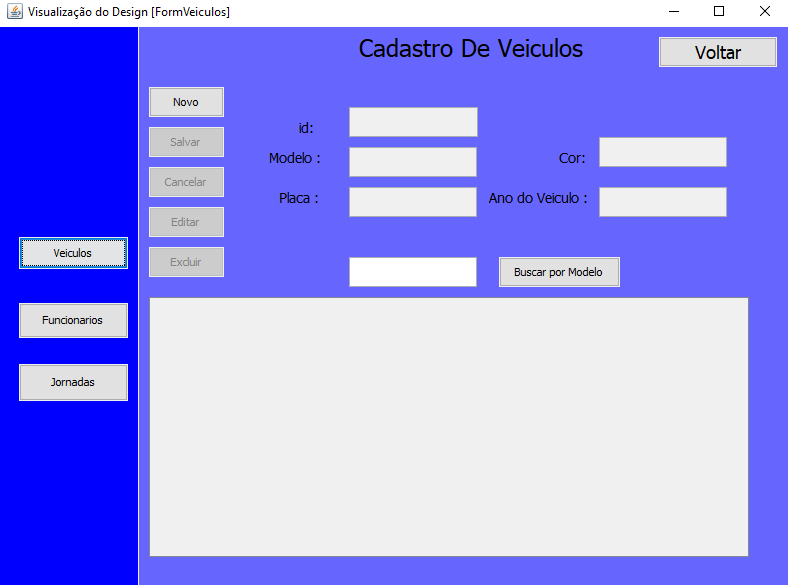
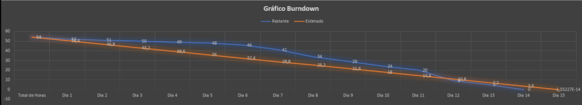
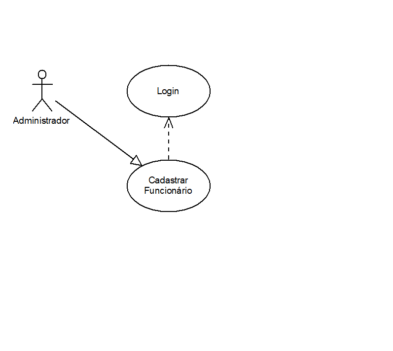
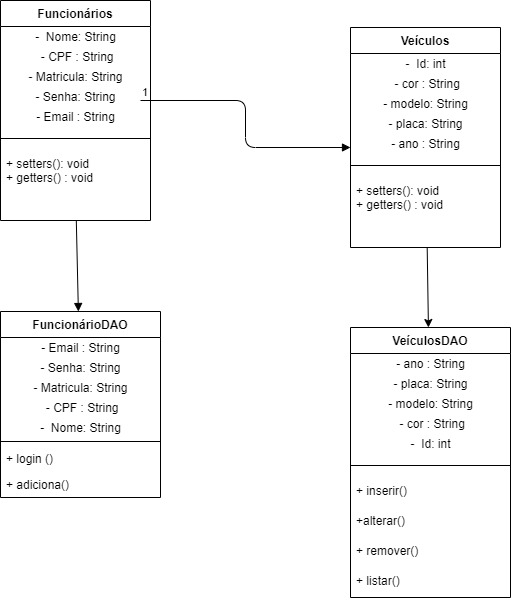

# Projeto Integrador FATECSJC 2020_2

# Objetivo
Para essa Sprint temos como objetivo o cadastro, edição e remoção dos dados dos funcionários e veículos  e resolução de algumas coisas da Sprint anterior.

As seguintes tasks foram definidas:
- Criação de um diagrama de casos de uso para o projeto.
- Criação de tabelas no Postgresql.
- Edição das tabelas no Postgresql.
- Remoção das tabelas no Postgresql.
- Integração do Java com o servidor Postgresql.
- Tela do CRUD dos veículos.
- Tela do CRUD dos motoristas.
- Cadastro dos veículos e funcionários.
- Edição dos dados dos veículos e funcionários.
- Remoção dos veículos e funcionários.

Sendo que destas priorizamos as últimas três:
- Cadastro dos veículos e funcionários.
- Edição dos dados dos veículos e funcionários.
- Remoção dos veículos e funcionários.

# Funcionalidades
As funcionalidades dessa Sprint consistem na criação de um CRUD tanto para os funcionários quanto aos veículos.

# Disciplinas Integradas
- Engenharia de Softaware ( Profª. Juliana Forin Pasquini Martiniz) 
- Sistemas de Informações (Profº. Cláudio Etelvino de Lima)

# Equipe (Grupo 4)
DevTeam:
- LUCAS VINICIUS DOS SANTOS ALMEIDA
- GABRIEL FERREIRA FABIAN
- JOAO VITOR DE PAULA RODRIGUES MACHADO
- PEDRO SOUSA LOPES

Scrum Master:
- NICOLAS SOARES TELLES

Product Owner: 

- MAYCON RAFAEL CRUZ SILVA

# Telas do App

# Programa Funcionando

# BurnDown

# Diagrama de Caso de Uso
Este caso de uso serve para que um administrador cadastre um novo funcionário.
O Administrador deve cadastrar um funcionário para que o mesmo consiga efetuar o login no sistema.

- Caso de Uso

# Diagrama de Classe

# Modelagem do BD
- Modelo conceitual

- Modelo lógico

# Acesse o Product Backlog
https://github.com/nicolastelles/PI-IACIT/projects/2
